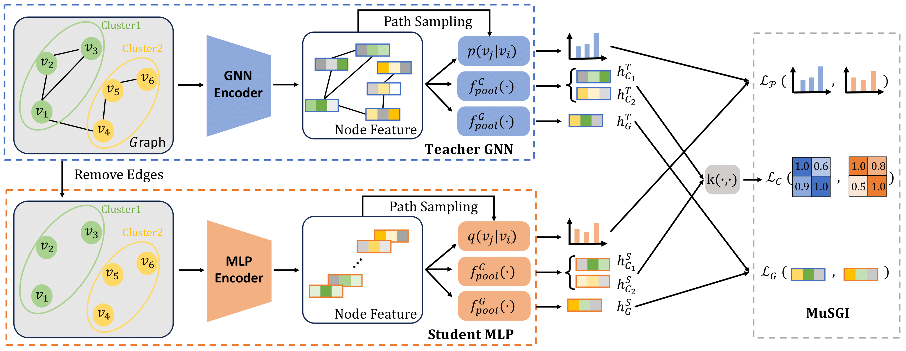
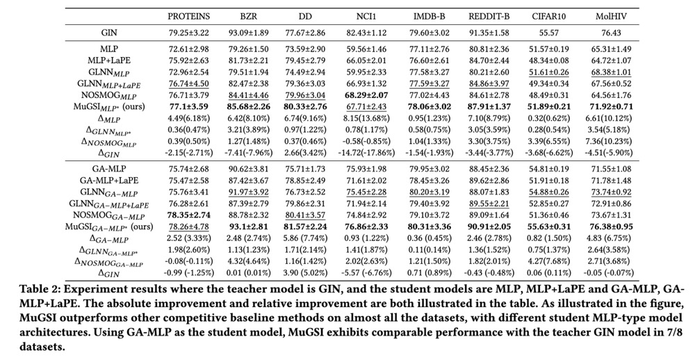

# MuGSI: Distilling GNNs with Multi-Granularity Structural Information for Graph Classification

This repository contains codes for our work: _MuGSI: Distilling GNNs with Multi-Granularity Structural Information for Graph Classification_ in WWW 2024. 

## Set up environment

To set up the virtual environment for our project, use _requirements.txt_ to install related libraries.

## Load and pre-process datasets

To load and preprocess TUdatasets, use the following command:

```bash
python DataPreTransform_TU.py --dataset $dataset_name$
```

To load and preprocess TUdatasets CIFAR10 and MOLHIV datasets, use the following command:

```bash
python DataPreTransform.py --dataset $dataset_name$
```

## Download pre-trained GNN models

To download the pre-trained GNN models as teachers, go to [this link](https://drive.google.com/file/d/1QYlPVbzJua4Ql5PBIl2wtciB2f3f7bnb/view?usp=drive_link) to download the pre-trained GNN models, unzip it and put the `best_models/` under the root directory.

## Run MuGSI

To run MuGSI, here is an example that uses LaPE, the student model is MLP, teacher model is GIN, the hyper-parameters to control graph-distillation, cluster distillation and node distillation are indicated by `--graphPoolingReg`, `--ClusterMatchingReg` and `--RandomWalkConsistencyReg` respectively. 

```bash
python run_Model_TU.py --use_KD  --device_id 0 --max_epochs 350 --dataset REDDIT-BINARY --hidden_dim 64 --out_dim 64 --dataset_index 0 --studentModelName MLP --teacherModelName GIN --lr_patience 30 --usePE --batch_size 32 --num_hops 1 --numWorkers 2  --useSoftLabel --softLabelReg 1.0 --useRandomWalkConsistency --RandomWalkConsistencyReg 0.0001 --useClusterMatching --ClusterMatchingReg 0.01 --useGraphPooling --graphPoolingReg 0.01 --KD_name MuGSI
```

To use GA-MLP as student model, use `--studentModelName GA-MLP`, remove `--usePE` to disable LaPE. `--dataset_index` indicates the fold used for the dataset, ranging from 0-9.

Tp run MolHiv, use the following command:

```bash
python run_Model_PCBA.py  --device_id 0 --trialId 1 --use_KD --dataset ogbg-molhiv  --drop_ratio 0.5  --studentModelName GA-MLP --lr_patience 30  --numWorkers 4 --useSoftLabel --softLabelReg 1.0 --useRandomWalkConsistency --RandomWalkConsistencyReg 0.0001 --useClusterMatching --ClusterMatchingReg 0.01 --useGraphPooling --graphPoolingReg 0.01 --KD_name useJoint
```

Similarly, one can use different student model, and try with different hyper-parameters for _RandomWalkConsistencyReg_, _ClusterMatchingReg_ and _graphPoolingReg_.

## Run GLNN

To run GLNN, only use `--useSoftLabel`, here is an example:
```bash
python run_Model_TU.py --use_KD  --device_id 0 --max_epochs 350 --dataset REDDIT-BINARY --hidden_dim 64 --out_dim 64 --dataset_index 0 --studentModelName MLP --teacherModelName GIN --lr_patience 30 --usePE --batch_size 32 --num_hops 1 --numWorkers 2  --useSoftLabel --softLabelReg 1.0 --KD_name GLNN
```

## Run NOSMOG

To run NOSMOG, see the following example:

```bash
python run_Model_TU.py --use_KD  --device_id 0 --max_epochs 350 --dataset REDDIT-BINARY --hidden_dim 64 --out_dim 64 --dataset_index 0 --studentModelName MLP --teacherModelName GIN --lr_patience 30 --usePE --batch_size 32 --num_hops 1 --numWorkers 2  --useSoftLabel --softLabelReg 1.0 --useNodeSim --nodeSimReg 0.1  --KD_name useNOSMOG
```

## Overall Framework

<p align="center">
  <br />
  
  <br />
</p>

## Results

<p align="center">
  <br />
  
  <br />
</p>


